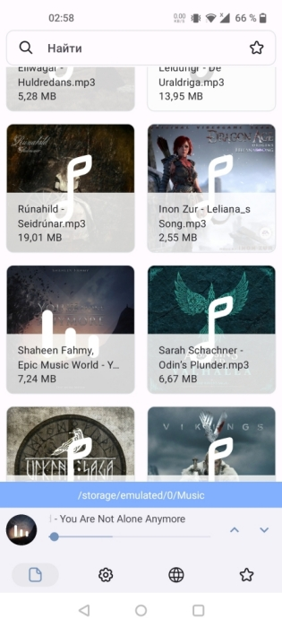

# FileGallery
Просмотр фото, видео, аудио, тэги

<b>Языки: Русский</b>

<b>Скриншот:</b>

<b>Инструкция по сборке:</b>
Требуется:
  1) Android Studio Electric Eel (2022.1.1) или выше. Kotlin 1.7.*
  2) Android SDK 32
  3) Android NDK 25.0.8775105
  
<b>Компиляция:</b>

  1) Для релизных сборок вам нужен сертификат.
        keytool -genkey -v -keystore ExampleKey.keystore -alias fenrir -storetype PKCS12 -keyalg RSA -keysize 2048 -validity 10000
  2) Выберите тип сборки Debug или Release и соберите apk :)

Локальный медиа сервер https://github.com/umerov1999/FenrirMediaServer/releases
